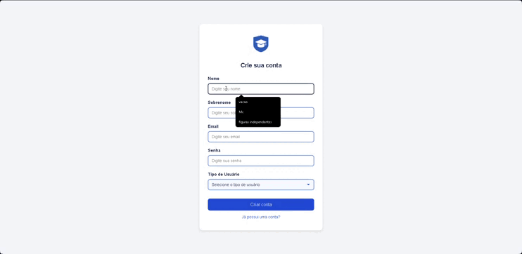
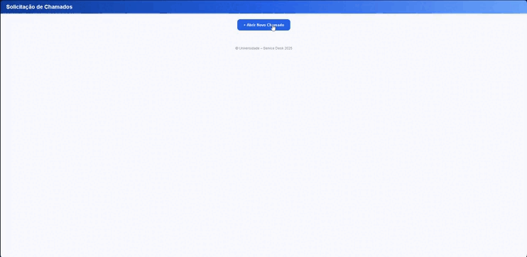
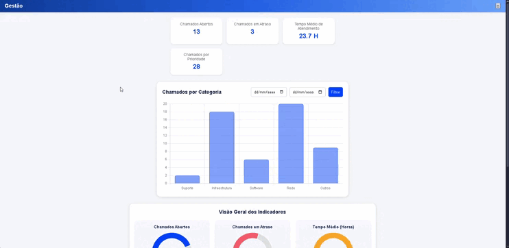

# 💻 Projeto de Extensão 4°: Sistema de Chamados de TI

Projeto web desenvolvido para a **gestão, análise e solicitação de chamados** em uma Central de Serviços de T.I. de uma Universidade. O sistema implementa um fluxo de trabalho completo, dividindo os usuários em três perfis distintos (Usuário Padrão, Analista e Gestor), garantindo um controle eficiente das demandas.

---

## 🚀 Teste Você Mesmo

| Tipo                         | Link                                                                                                  |
| :--------------------------- | :---------------------------------------------------------------------------------------------------- |
| 🌐 **GitHub Pages (Demo)**   | [Acessar o Sistema de Chamados](https://matheuspenas.github.io/ProjetoDeExten-o4-semestre/)           |
| 💻 **Repositório no GitHub** | [Matheuspenas/ProjetoDeExten-o4-semestre](https://github.com/Matheuspenas/ProjetoDeExten-o4-semestre) |

---

## 🔍 Funcionalidades Chave

O sistema é segmentado por perfis, oferecendo funcionalidades específicas para cada tipo de usuário:

### 👤 Usuário Padrão

- **1. Solicitação de Chamado:** Criação de novas demandas para a Central de Serviços de T.I.

### 🧑‍💻 Analista

- **2. Encaminhamento de Chamados:** Recebimento das solicitações para processamento.
- **3. Gestão de Chamados:** Possibilidade de mudar o **Status** e definir a **Prioridade** das demandas.

### 📊 Gestor

- **Página Dedicada de Análise:** Visualização de dados totais e percentuais (conclusão, cancelamento, etc.).
- **Análise de Desempenho:** Cálculo da média do tempo de conclusão dos chamados.

### Funcionalidades Básicas

- **1. Criação de Conta e Login:** Sistema robusto de autenticação de usuários.
- **2. Recuperação de Senha:** Funcionalidade para redefinição de credenciais.

---

## 💻 Tecnologias Utilizadas

Este é um projeto front-end que utiliza as bases do desenvolvimento web:

- `Visual Studio Code (VS Code)` (Ambiente de Desenvolvimento)
- `GitHub` (Controle de Versão e Hospedagem)

---

## 📲 Linguagens Utilizadas

- `HTML` (Estrutura)
- `CSS` (Estilização e Layout)
- `JavaScript (vanilla)` (Lógica de Negócio e Interatividade)

---

## 🧠 Lógica e Fluxo de Trabalho

A lógica do projeto se baseia na segregação de acesso e responsabilidades:

1.  O **Usuário Padrão** se autentica e abre um chamado.
2.  O chamado é **encaminhado** para a página dedicada do **Analista**.
3.  O Analista assume o chamado, define sua **Prioridade** e acompanha sua execução alterando o **Status**.
4.  O **Gestor** tem uma visão macro, acessando métricas em tempo real sobre o volume, o desempenho e a eficiência da Central de Serviços.

---

## 🖥️ Demonstrações (GIFs)

- **Tela de Login e Cadastro:**

  

- **Dashboard do Usuário (Solicitação de Chamado):**

  

- **Dashboard do Analista (Gestão de Chamados):**

  

- **Dashboard do Gestor (Métricas e Análise):**

  

---

## 👤 Autores

**Matheus Gustavo Pena Luiz**

| Contato          | Link                                                                                                                   |
| :--------------- | :--------------------------------------------------------------------------------------------------------------------- |
| 📧 **Email**     | [mathegupena@gmail.com](mailto:mathegupena@gmail.com)                                                                  |
| 💼 **LinkedIn**  | [linkedin.com/in/matheus-gustavo-pena-luiz-07a113326](https://www.linkedin.com/in/matheus-gustavo-pena-luiz-07a113326) |
| 📸 **Instagram** | [@matheuspenass](https://www.instagram.com/matheuspenass)                                                              |
| 💻 **GitHub**    | [matheuspenas](https://github.com/matheuspenas)                                                                        |

**Paulo Vinícius Carraro**

| Contato          | Link                                                                                                     |
| :--------------- | :------------------------------------------------------------------------------------------------------- |
| 📧 **Email**     | [paulovcarraro@gmail.com](mailto:paulovcarraro@gmail.com)                                                |
| 💼 **LinkedIn**  | [linkedin.com/in/paulo-vinicius-carraro-250619348](www.linkedin.com/in/paulo-vinicius-carraro-250619348) |
| 📸 **Instagram** | [@paulo.\_carraro](https://www.instagram.com/paulo._carraro?igsh=M3N1c3pjMjYwdzhw)                       |
| 💻 **GitHub**    | [paulovcarraro](https://github.com/Paulovcarraro)                                                        |
